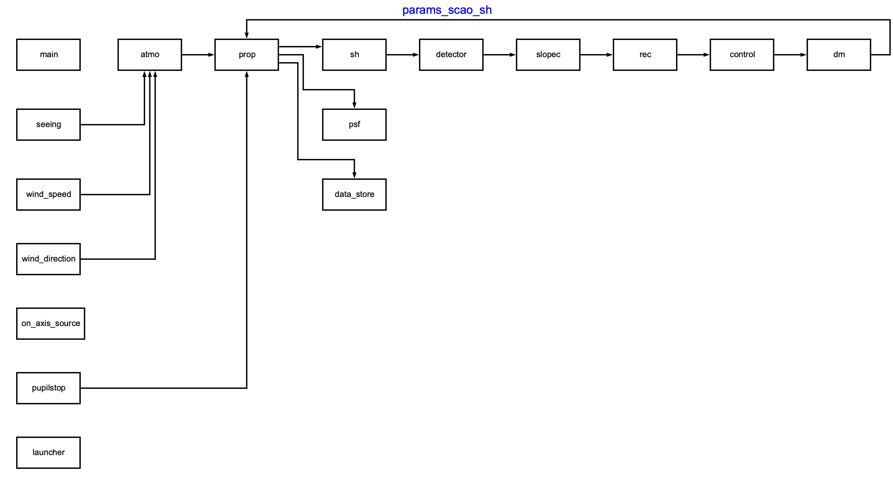
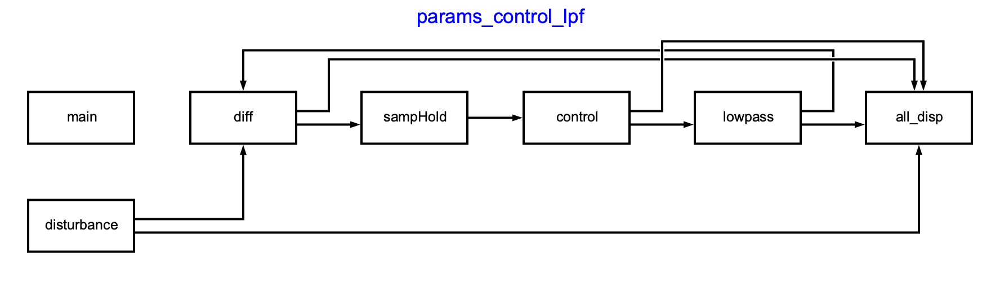

Simulation diagrams
===================

Here are some example of simulation diagrams generated by the :class:`specula.simul.Simul` class.

The diagram corresponding to the parameters file ``main/scao/params_scao_sh.yml`` can be generated during a simulation with the following command:

.. code-block:: bash

    specula params_scao_sh.yml --diagram

A file named ``params_scao_sh.png`` will be created in the current directory, containing the diagram of the simulation.
The diagram is:

Another example is the diagram corresponding to the parameters file ``main/scao/params_control_lpf.yml``:

.. code-block:: bash

